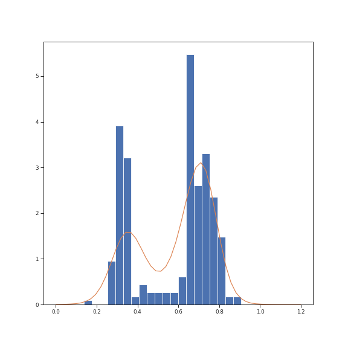

[![Contributors][contributors-shield]][contributors-url]
[![Forks][forks-shield]][forks-url]
[![Stargazers][stars-shield]][stars-url]
[![Issues][issues-shield]][issues-url]
[![Apache License 2.0][license-shield]][license-url]
[![LinkedIn][linkedin-shield]][linkedin-url]

# Bernstein-Polynomials as TensorFlow Probability Bijector

This Repository contains a implementation of a normalizing flow for conditional density estimation using Bernstein polynomials, as proposed in:

> Sick Beate, Hothorn Torsten and Dürr Oliver, *Deep transformation models: Tackling complex regression problems with neural network based transformation models*, 2020. [online](http://arxiv.org/abs/2004.00464)

The [`tfp.Bijector`][bijector] interface is used for the implementation to benefit from the powerful [TensorFlow Probability][tensorflow-probability] framework.

<!-- MarkdownTOC levels=2 -->

- [The Need for Flexible Distributions](#the-need-for-flexible-distributions)
- [Getting Started](#getting-started)
- [Usage](#usage)
- [Examples](#examples)
- [Contributing](#contributing)
- [License](#license)

<!-- /MarkdownTOC -->


## The Need for Flexible Distributions

Traditional regression models assume normality and homoscedasticity of the data, i.e. the residuals for each input value are expected to be normally distributed with constant variance.
However, the shape of the data distribution in many real use cases is much more complex.

The following example of a classical data set containing the waiting time between eruptions of the [Old Faithful Geyser](https://en.wikipedia.org/wiki/Old_Faithful) in [Yellowstone National Park](https://en.wikipedia.org/wiki/Yellowstone_National_Park) is used as an example.

| Gaussian                                                     | Normalizing Flow                           |
|:-------------------------------------------------------------|:-------------------------------------------|
|                                       |                       |

As shown in the left figure, the normality assumption is clearly violated by the bimodal nature of the data.
However, the proposed transformation model has the flexibility to adapt to this complexity.

## Getting Started

To start using my code follow these simple steps.

### Installation

Pull and install it directly from git using pip:

```bash
pip install git+https://github.com/MArpogaus/TensorFlow-Probability-Bernstein-Polynomial-Bijector.git
```

Or clone this repository an install it from there:

```bash
git clone https://github.com/MArpogaus/TensorFlow-Probability-Bernstein-Polynomial-Bijector.git ./bernstein_flow
cd bernstein_flow
pip install -e .
```

### Prerequisites

Pip should take care of installing the required dependencies on its own.
For completeness, these are the packages used in the implementation:

 * [`matplotlib`][matplotlib]
 * [`numpy`][numpy]
 * [`scipy`][scipy]
 * [`tensorflow`][tensorflow]
 * [`tensorflow_probability`][tensorflow-probability]

## Usage

### Package Structure 

This python package consists of four main components:

 * `berstein_flow.bijectors.BernsteinBijector`: The implementation of Bernstein polynomials using the `tfb.Bijector` interface for
    transformations of `tfd.Distribution` samples.
 * `berstein_flow.distributions.BernsteinFlow`:  The implementation of a `tfd.TransformedDistribution` using the Bernstein
    polynomials as the bijector.
 * `berstein_flow.losses.BernsteinFlowLoss`: The implementation of a `tfk.losses.Loss` function to calculate the negative logarithmic likelihood using the `BernstinFlow` distribution.
 * `berstein_flow.util.visualization`: Contains of some convenient helper functions for visualization.

### Using the Model as a `tfpl.DistributionLambda`

A [`tfd.TransformedDistribution`][transformed-distribution] using the [BernsteinBijector][bernstein-bijector] is provided in the module `bernstein_flow.distributions.BernsteinFlow`:

```python
from bernstein_flow.distributions import BernsteinFlow
```

Use it like any other distribution, i.e. as a [`tfpl.DistributionLambda`][distribution-lambda].

The two example plots shown above have been generated using the following two models.

### Gaussian Model

```python
gauss_model = tf.keras.Sequential()
gauss_model.add(InputLayer(input_shape = (1)))
#Here could come a gigantus network
gauss_model.add(Dense(2)) # mean and the std of the Gaussian
gauss_model.add(tfp.layers.DistributionLambda(
    lambda pv:
        tfd.Normal(loc=pv[:,0], scale=1e-3 + tf.math.softplus(0.05 * pv[:,1]))))
```

### Normalizing FLow

```python
flow_model = tf.keras.Sequential()
flow_model.add(InputLayer(input_shape = (1)))
#Here could come a gigantus network
flow_model.add(Dense(4 + 5)) # Bernstein coefficients and 2 times scale and shift
flow_model.add(tfp.layers.DistributionLambda(BernsteinFlow))
```

## Examples

You can find two examples in the `ipynb` directory:

 * `TheoreticalBackground.ipynb`: Some explanation of the theoretical fundamentals
 * `Gaussian_vs_Transformation_Model.ipynb`: Bimodal data example shown in the figures above.

## Contributing

If you have any technical issues or suggestion regarding my implementation, please feel free to either [contact me](mailto:marcel.arpogaus@gmail.com), [open an issue][open-an-issue] or send me a Pull Request:

1. Fork the Project
2. Create your Feature Branch (`git checkout -b feature/AmazingFeature`)
3. Commit your Changes (`git commit -m 'Add some AmazingFeature'`)
4. Push to the Branch (`git push origin feature/AmazingFeature`)
5. Open a Pull Request

Any contributions are **greatly appreciated**.

## License

Distributed under the [Apache License 2.0](LICENSE)

[contributors-shield]: https://img.shields.io/github/contributors/MArpogaus/TensorFlow-Probability-Bernstein-Polynomial-Bijector.svg?style=flat-square
[contributors-url]: https://github.com/MArpogaus/TensorFlow-Probability-Bernstein-Polynomial-Bijector/graphs/contributors
[forks-shield]: https://img.shields.io/github/forks/MArpogaus/TensorFlow-Probability-Bernstein-Polynomial-Bijector.svg?style=flat-square
[forks-url]: https://github.com/MArpogaus/TensorFlow-Probability-Bernstein-Polynomial-Bijector/network/members
[stars-shield]: https://img.shields.io/github/stars/MArpogaus/TensorFlow-Probability-Bernstein-Polynomial-Bijector.svg?style=flat-square
[stars-url]: https://github.com/MArpogaus/TensorFlow-Probability-Bernstein-Polynomial-Bijector/stargazers
[issues-shield]: https://img.shields.io/github/issues/MArpogaus/TensorFlow-Probability-Bernstein-Polynomial-Bijector.svg?style=flat-square
[issues-url]: https://github.com/MArpogaus/TensorFlow-Probability-Bernstein-Polynomial-Bijector/issues
[license-shield]: https://img.shields.io/github/license/MArpogaus/TensorFlow-Probability-Bernstein-Polynomial-Bijector.svg?style=flat-square
[license-url]: https://github.com/MArpogaus/TensorFlow-Probability-Bernstein-Polynomial-Bijector/blob/master/LICENSE
[linkedin-shield]: https://img.shields.io/badge/-LinkedIn-black.svg?style=flat-square&logo=linkedin&colorB=555
[linkedin-url]: https://linkedin.com/in/MArpogaus
[bijector]: https://www.tensorflow.org/probability/api_docs/python/tfp/bijectors/Bijector
[tensorflow-probability]: https://www.tensorflow.org/probability
[matplotlib]: https://matplotlib.org/
[numpy]: https://numpy.org/
[scipy]: https://scipy.org/
[tensorflow]: https://www.tensorflow.org/
[transformed-distribution]: https://www.tensorflow.org/probability/api_docs/python/tfp/distributions/TransformedDistribution
[bernstein-bijector]: https://github.com/MArpogaus/TensorFlow-Probability-Bernstein-Polynomial-Bijector/blob/master/src/bernstein_flow/bijectors/bernstein_bijector.py
[distribution-lambda]: https://www.tensorflow.org/probability/api_docs/python/tfp/layers/DistributionLambda
[open-an-issue]: https://github.com/MArpogaus/TensorFlow-Probability-Bernstein-Polynomial-Bijector/issues/new
